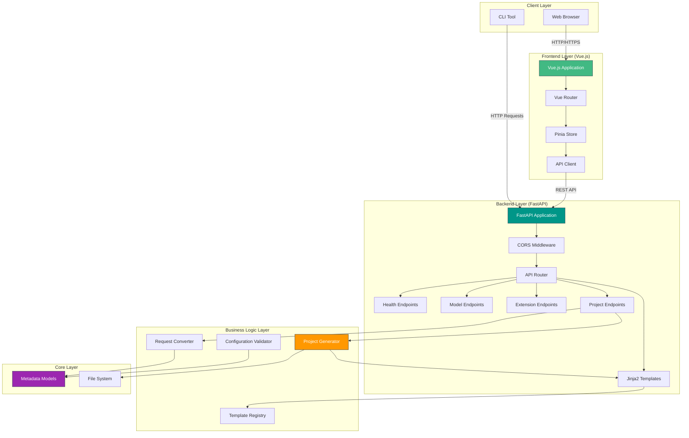
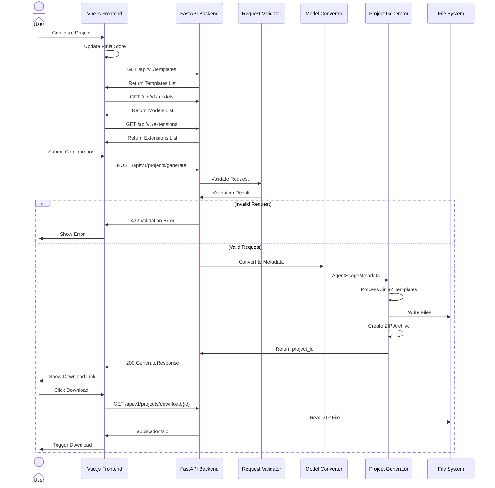
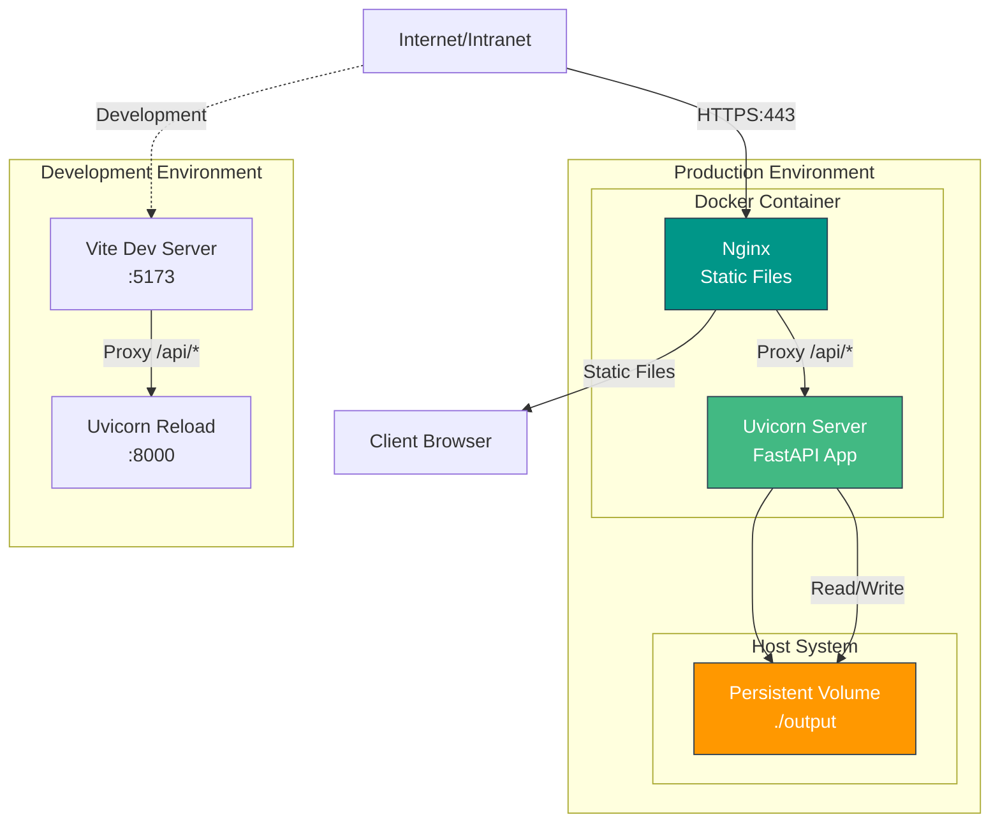

# AgentScope Initializr Web Service - Architecture Documentation

## System Architecture Overview



## Component Relationship Diagram

```mermaid
graph LR
    subgraph "Frontend Components"
        BasicSettings[BasicSettings.vue]
        TemplateSelector[TemplateSelector.vue]
        ConfigForm[ConfigurationForm.vue]
        HomeView[Home.vue]
        ConfigureView[Configure.vue]
    end

    subgraph "State Management"
        ConfigStore[Config Store]
    end

    subgraph "API Layer"
        APIClient[API Client]
        HealthAPI[Health API]
        TemplatesAPI[Templates API]
        ModelsAPI[Models API]
        ExtensionsAPI[Extensions API]
        ProjectsAPI[Projects API]
    end

    subgraph "Backend Router"
        HealthRouter[/health]
        TemplatesRouter[/api/v1/templates]
        ModelsRouter[/api/v1/models]
        ExtensionsRouter[/api/v1/extensions]
        ProjectsRouter[/api/v1/projects]
    end

    subgraph "Core Services"
        ProjectGen[ProjectGenerator]
        TemplateReg[TemplateRegistry]
        ModelProv[ModelProviderRegistry]
    end

    BasicSettings --> ConfigStore
    TemplateSelector --> ConfigStore
    ConfigForm --> ConfigStore
    ConfigForm --> APIClient
    HomeView --> ConfigureView
    ConfigureView --> ConfigForm

    ConfigStore --> APIClient
    APIClient --> HealthAPI
    APIClient --> TemplatesAPI
    APIClient --> ModelsAPI
    APIClient --> ExtensionsAPI
    APIClient --> ProjectsAPI

    HealthAPI --> HealthRouter
    TemplatesAPI --> TemplatesRouter
    ModelsAPI --> ModelsRouter
    ExtensionsAPI --> ExtensionsRouter
    ProjectsAPI --> ProjectsRouter

    TemplatesRouter --> TemplateReg
    ModelsRouter --> ModelProv
    ProjectsRouter --> ProjectGen

    style ConfigStore fill:#41b883,stroke:#2c3e50,color:#fff
    style APIClient fill:#009688,stroke:#2c3e50,color:#fff
    style ProjectGen fill:#ff9800,stroke:#2c3e50,color:#fff
```

## API Endpoint Structure

```mermaid
graph TD
    API[API Base: /api/v1]

    subgraph "Health Endpoints"
        H1[GET /health]
        H2[GET /health/detailed]
    end

    subgraph "Template Endpoints"
        T1[GET /api/v1/templates]
    end

    subgraph "Model Endpoints"
        M1[GET /api/v1/models]
    end

    subgraph "Extension Endpoints"
        E1[GET /api/v1/extensions]
    end

    subgraph "Project Endpoints"
        P1[POST /api/v1/projects/generate]
        P2[GET /api/v1/projects/download/{project_id}]
    end

    API --> T1
    API --> M1
    API --> E1
    API --> P1
    API --> P2

    H1 -->|200| HealthResp[HealthResponse]
    H2 -->|200| DetailedHealth[DetailedHealth]

    T1 -->|200| TemplatesResp[TemplatesResponse]
    T1 -.->|Error| Error1[400/500]

    M1 -->|200| ModelsResp[ModelsResponse]
    M1 -.->|Error| Error2[400/500]

    E1 -->|200| ExtensionsResp[ExtensionsResponse]
    E1 -.->|Error| Error3[400/500]

    P1 -->|200| GenResp[GenerateResponse]
    P1 -->|422| ValidationError[ValidationError]
    P1 -.->|Error| Error4[500]

    P2 -->|200| ZipFile[application/zip]
    P2 -->|404| NotFound[ProjectNotFound]

    style HealthResp fill:#4caf50,stroke:#2c3e50,color:#fff
    style ValidationError fill:#f44336,stroke:#2c3e50,color:#fff
    style ZipFile fill:#2196f3,stroke:#2c3e50,color:#fff
```

## Data Flow Diagram



## Deployment Architecture



## Technology Stack

### Frontend Stack
- **Framework**: Vue.js 3.4+ (Composition API)
- **Language**: TypeScript 5.3+
- **Routing**: Vue Router 4.2+
- **State Management**: Pinia 2.1+
- **UI Components**: Element Plus 2.5+
- **Build Tool**: Vite 5.0+
- **HTTP Client**: Axios 1.6+

### Backend Stack
- **Framework**: FastAPI 0.104+
- **Server**: Uvicorn 0.24+ (ASGI)
- **Validation**: Pydantic v2
- **CORS**: FastAPI CORS Middleware
- **File I/O**: aiofiles 23.2+

### Core Stack
- **Template Engine**: Jinja2
- **Project Generation**: Custom ProjectGenerator
- **Metadata Management**: Pydantic Models

### Deployment Stack
- **Containerization**: Docker
- **Multi-stage Build**: Dockerfile
- **Orchestration**: Docker Compose
- **Reverse Proxy**: Nginx (production)

## Directory Structure

```
agentscope-initializr/
├── initializr-core/              # Core generation engine
│   ├── metadata/                # Metadata models
│   ├── generator/               # Project generator
│   └── validator/               # Configuration validator
│
├── initializr-cli/               # Command-line interface
│   └── agentscope_init/
│       ├── __init__.py
│       └── cli.py               # CLI commands
│
├── initializr-web/               # Web interface
│   ├── initializr_web/          # FastAPI backend
│   │   ├── __init__.py
│   │   ├── main.py              # Uvicorn entry point
│   │   ├── api.py               # FastAPI app configuration
│   │   ├── models.py            # Pydantic request/response models
│   │   ├── converter.py         # Request → Metadata converter
│   │   ├── generator.py         # Project generation utilities
│   │   └── router/              # API endpoints
│   │       ├── health.py        # Health check endpoints
│   │       ├── templates.py     # Template listing
│   │       ├── models.py        # Model providers listing
│   │       ├── extensions.py    # Extension points listing
│   │       └── projects.py      # Project generation/download
│   │
│   ├── frontend/                # Vue.js frontend
│   │   ├── src/
│   │   │   ├── main.ts          # App entry point
│   │   │   ├── App.vue          # Root component
│   │   │   ├── types/           # TypeScript interfaces
│   │   │   ├── api/             # API client & services
│   │   │   ├── stores/          # Pinia stores
│   │   │   ├── components/      # Vue components
│   │   │   └── views/           # Vue views
│   │   ├── package.json
│   │   ├── vite.config.ts
│   │   └── tsconfig.json
│   │
│   └── tests/                   # Web service tests
│       ├── test_models.py       # Model validation tests
│       ├── test_api.py          # API endpoint tests
│       ├── test_integration.py  # Integration tests
│       └── test_e2e.py          # End-to-end tests
│
├── initializr-templates/         # Project templates
│   ├── basic/
│   ├── multi-agent/
│   ├── research/
│   └── browser/
│
├── Dockerfile                    # Multi-stage Docker build
├── docker-compose.yml            # Service orchestration
└── pyproject.toml                # Python package configuration
```

## Key Design Patterns

### 1. Separation of Concerns
- **Frontend**: UI/UX only, no business logic
- **Backend**: API and validation, no presentation
- **Core**: Reusable business logic

### 2. API Versioning
- All API endpoints prefixed with `/api/v1`
- Allows future breaking changes without affecting existing clients

### 3. Request Validation
- Pydantic models ensure type safety
- Automatic validation and error messages
- Clear API contracts

### 4. State Management
- Pinia stores manage form state across components
- Single source of truth for configuration
- Reactive updates to UI

### 5. Asynchronous Processing
- FastAPI async endpoints for better performance
- aiofiles for non-blocking file I/O
- Streaming download for large ZIP files

### 6. Template-based Generation
- Jinja2 templates for flexible code generation
- Template registry for extensibility
- Easy addition of new project types

## Security Considerations

### CORS Configuration
- Controlled origins in production
- Development mode allows localhost

### Input Validation
- Pydantic models validate all inputs
- Length constraints on string fields
- Pattern validation for enums

### File Access
- Sandboxed project generation
- Output directory isolation
- Automatic cleanup of temporary files

### Dependency Management
- Pinned versions in requirements
- Regular security updates
- Minimal attack surface

## Performance Optimization

### Frontend
- Vite for fast development builds
- Code splitting in Vue Router
- Lazy loading of components
- Production minification and tree-shaking

### Backend
- Async I/O for better concurrency
- Template caching
- ZIP file streaming (not buffering entire file)
- Health check caching

### Deployment
- Multi-stage Docker builds
- Nginx for static file serving
- Gzip compression
- HTTP/2 support

## Testing Strategy

### Unit Tests
- Model validation (6 tests)
- API endpoint behavior (7 tests)

### Integration Tests
- Full workflow testing (2 tests)
- Request/response validation

### End-to-End Tests
- Complete user journey
- Real server deployment
- ZIP file verification

**Coverage**: 15/15 tests passing (100%)

## Scalability Considerations

### Horizontal Scaling
- Stateless API design
- Docker containerization
- Load balancer ready

### Caching Strategy
- Template registry in memory
- Model provider list
- Extension point configuration

### File Storage
- Persistent volume for generated projects
- Automatic cleanup policy
- Configurable retention period

## Monitoring and Observability

### Health Checks
- `/health` - Basic liveness
- `/health/detailed` - Detailed status

### Logging
- Structured JSON logging
- Request/response logging
- Error tracking

### Metrics (Future)
- Request rate
- Generation time
- Error rate
- Storage usage

## Future Enhancements

### Planned Features
1. **Authentication & Authorization**
   - User accounts
   - API keys
   - Usage quotas

2. **Advanced Templates**
   - Custom template upload
   - Template marketplace
   - Version control for templates

3. **Project Management**
   - Save/load configurations
   - Project history
   - Configuration sharing

4. **Enhanced UI**
   - Live preview
   - Interactive documentation
   - Progress indicators

5. **Analytics**
   - Usage statistics
   - Template popularity
   - Error reporting

6. **Performance**
   - Redis caching
   - Background job processing
   - CDN for static assets

---

**Document Version**: 1.0
**Last Updated**: 2026-03-27
**Author**: AgentScope Initializr Team
