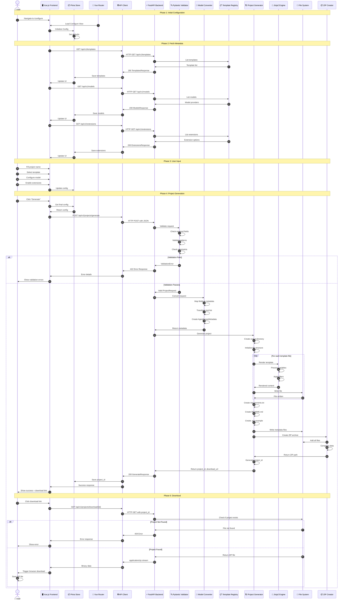
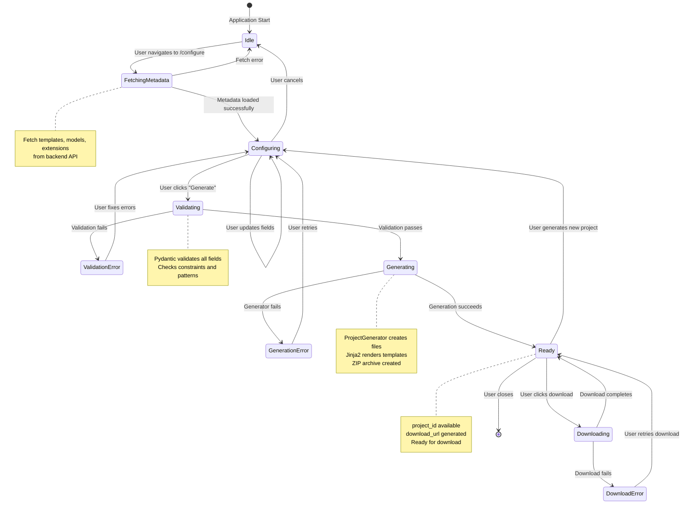

# Project Generation Flow - Detailed Sequence

## Complete Project Generation Sequence



## Component Interaction Map

```
┌─────────────────────────────────────────────────────────────────────────────┐
│                          PROJECT GENERATION FLOW                            │
└─────────────────────────────────────────────────────────────────────────────┘

┌──────────────┐
│    CLIENT    │
│              │  ┌──────────────────────────────────────────────────────────┐
│  ┌────────┐  │  │ Phase 1: INITIALIZATION                                 │
│  │ Browser│──┼──┤ • User navigates to /configure                         │
│  └────────┘  │  │ • Vue Router loads Configure View                      │
│              │  │ • Pinia Store initializes with defaults                 │
└──────┬───────┘  └──────────────────────────────────────────────────────────┘
       │
       │ HTTP Request
       ▼
┌──────────────────────────────────────────────────────────────────────────────┐
│                         FRONTEND LAYER (Vue.js)                              │
├──────────────────────────────────────────────────────────────────────────────┤
│  ┌─────────────────┐    ┌─────────────────┐    ┌─────────────────┐         │
│  │  BasicSettings  │    │TemplateSelector │    │ConfigurationForm│         │
│  │     .vue        │◄───│     .vue        │◄───│     .vue        │         │
│  └────────┬────────┘    └────────┬────────┘    └────────┬────────┘         │
│           │                      │                      │                    │
│           └──────────────────────┴──────────────────────┘                    │
│                                  │                                           │
│                                  ▼                                           │
│                      ┌─────────────────────┐                                 │
│                      │   Config Store      │                                 │
│                      │    (Pinia)          │                                 │
│                      │  - Project name     │                                 │
│                      │  - Template type    │                                 │
│                      │  - Model provider   │                                 │
│                      │  - Extensions       │                                 │
│                      └──────────┬──────────┘                                 │
└─────────────────────────────────┼──────────────────────────────────────────┘
                                  │
                                  │ API Calls
                                  ▼
┌──────────────────────────────────────────────────────────────────────────────┐
│                          API LAYER (Axios)                                   │
├──────────────────────────────────────────────────────────────────────────────┤
│  ┌──────────────┐  ┌──────────────┐  ┌──────────────┐  ┌──────────────┐    │
│  │  Health API  │  │Templates API │  │  Models API  │  │Projects API  │    │
│  │              │  │              │  │              │  │              │    │
│  │ GET /health  │  │ GET /templates│ │ GET /models  │  │ POST /generate│   │
│  └──────────────┘  └──────────────┘  └──────────────┘  └──────┬───────┘    │
│                                                                  │            │
└──────────────────────────────────────────────────────────────────┼────────────┘
                                                                   │
                                                                   │ REST API
                                                                   ▼
┌──────────────────────────────────────────────────────────────────────────────┐
│                        BACKEND LAYER (FastAPI)                                 │
├──────────────────────────────────────────────────────────────────────────────┤
│                                                                              │
│  ┌──────────────────────────────────────────────────────────────────────┐   │
│  │                         API Router                                   │   │
│  │  ┌─────────┐  ┌─────────┐  ┌─────────┐  ┌─────────┐  ┌─────────┐   │   │
│  │  │ Health  │  │Template │  │ Models  │  │Extension│  │Projects │   │   │
│  │  │ Router  │  │ Router  │  │ Router  │  │ Router  │  │ Router  │   │   │
│  │  └────┬────┘  └────┬────┘  └────┬────┘  └────┬────┘  └────┬────┘   │   │
│  └───────┼────────────┼────────────┼────────────┼────────────┼──────────┘   │
│          │            │            │            │            │              │
│          └────────────┴────────────┴────────────┴────────────┘              │
│                                   │                                           │
│                                   ▼                                           │
│  ┌────────────────────────────────────────────────────────────────────┐     │
│  │                      Pydantic Validator                            │     │
│  │  • Validate request structure                                      │     │
│  │  • Check field constraints                                         │     │
│  │  • Type validation                                                 │     │
│  │  • Return ValidationError or ProjectRequest                        │     │
│  └───────────────────────────┬──────────────────────────────────────┘     │
└──────────────────────────────┼──────────────────────────────────────────────┘
                               │
                               │ Valid Request
                               ▼
┌──────────────────────────────────────────────────────────────────────────────┐
│                       BUSINESS LOGIC LAYER                                    │
├──────────────────────────────────────────────────────────────────────────────┤
│                                                                              │
│  ┌────────────────────────────────────────────────────────────────────┐     │
│  │                        Model Converter                              │     │
│  │  ProjectRequest → AgentScopeMetadata                                │     │
│  │  • Map field names                                                  │     │
│  │  • Transform tool list to ToolConfig objects                        │     │
│  │  • Convert enum values                                              │     │
│  │  • Create memory configuration                                      │     │
│  └───────────────────────────┬──────────────────────────────────────┘     │
│                              │                                              │
│                              ▼                                              │
│  ┌────────────────────────────────────────────────────────────────────┐     │
│  │                      Project Generator                              │     │
│  │  • Create output directory                                         │     │
│  │  • Load Jinja2 templates                                           │     │
│  │  • Render template files                                           │     │
│  │  • Write generated files to disk                                   │     │
│  │  • Create ZIP archive                                              │     │
│  │  • Generate unique project_id                                       │     │
│  └───────────────────────────┬──────────────────────────────────────┘     │
└──────────────────────────────┼──────────────────────────────────────────────┘
                               │
                               │ File I/O
                               ▼
┌──────────────────────────────────────────────────────────────────────────────┐
│                         DATA LAYER                                            │
├──────────────────────────────────────────────────────────────────────────────┤
│                                                                              │
│  ┌──────────────┐    ┌──────────────┐    ┌──────────────┐                   │
│  │   Jinja2     │    │  File System │    │ZIP Creator   │                   │
│  │  Templates   │    │              │    │              │                   │
│  │              │    │ /output/     │    │ .zip files   │                   │
│  │ • basic/     │    │              │    │              │                   │
│  │ • multi/     │    │ {project_id}/│    │ project.zip  │                   │
│  │ • research/  │    │   └── ...    │    │              │                   │
│  │ • browser/   │    │              │    │              │                   │
│  └──────────────┘    └──────────────┘    └──────────────┘                   │
│                                                                              │
└──────────────────────────────────────────────────────────────────────────────┘

┌──────────────────────────────────────────────────────────────────────────────┐
│                          RESPONSE FLOW                                        │
└──────────────────────────────────────────────────────────────────────────────┘

Success Path:
  Generator → project_id → FastAPI → GenerateResponse → API → Vue → User

Error Path:
  Validator → ValidationError → FastAPI → 422 Error → API → Vue → User
  Generator → Exception → FastAPI → 500 Error → API → Vue → User

Download Path:
  User → Vue → API → FastAPI → File System → ZIP stream → Browser → Download
```

## State Transition Diagram



## Error Handling Flow

```
┌─────────────────────────────────────────────────────────────────┐
│                     ERROR HANDLING STRATEGY                      │
└─────────────────────────────────────────────────────────────────┘

CLIENT ERRORS (4xx)
┌─────────────────────────────────────────────────────────────────┐
│ ValidationError (422)                                           │
├─────────────────────────────────────────────────────────────────┤
│ Source: Pydantic validation                                     │
│ Trigger: Invalid request body                                   │
│ Response:                                                       │
│   {                                                             │
│     "detail": [                                                │
│       {                                                         │
│         "loc": ["body", "name"],                               │
│         "msg": "field required",                               │
│         "type": "value_error.missing"                          │
│       }                                                         │
│     ]                                                           │
│   }                                                             │
│ Action: Show inline validation errors in form                   │
└─────────────────────────────────────────────────────────────────┘

SERVER ERRORS (5xx)
┌─────────────────────────────────────────────────────────────────┐
│ GenerationError (500)                                           │
├─────────────────────────────────────────────────────────────────┤
│ Source: ProjectGenerator exception                              │
│ Trigger: Template rendering failure, file I/O error             │
│ Response:                                                       │
│   {                                                             │
│     "detail": "Failed to generate project: ..."                │
│   }                                                             │
│ Action: Show error message, offer retry button                  │
└─────────────────────────────────────────────────────────────────┘

NETWORK ERRORS
┌─────────────────────────────────────────────────────────────────┐
│ NetworkError                                                    │
├─────────────────────────────────────────────────────────────────┤
│ Source: Axios network error                                    │
│ Trigger: Connection timeout, server unreachable                 │
│ Action: Show error message, offer retry with exponential backoff│
└─────────────────────────────────────────────────────────────────┘

NOT FOUND ERRORS
┌─────────────────────────────────────────────────────────────────┐
│ NotFoundError (404)                                             │
├─────────────────────────────────────────────────────────────────┤
│ Source: Project download endpoint                               │
│ Trigger: Invalid project_id, expired project                    │
│ Response:                                                       │
│   {                                                             │
│     "detail": "Project not found or has expired"               │
│   }                                                             │
│ Action: Show error, redirect to configure page                 │
└─────────────────────────────────────────────────────────────────┘
```

## Performance Optimization Points

```
┌─────────────────────────────────────────────────────────────────┐
│                    PERFORMANCE OPTIMIZATION                      │
└─────────────────────────────────────────────────────────────────┘

FRONTEND OPTIMIZATION
├─ Lazy Loading
│  └─ Components loaded on demand
│
├─ Code Splitting
│  └─ Separate bundles per route
│
├─ Caching
│  └─ Metadata cached in Pinia store
│
└─ Debouncing
   └─ Input changes debounced (300ms)

BACKEND OPTIMIZATION
├─ Async I/O
│  └─ Non-blocking file operations
│
├─ Template Caching
│  └─ Jinja2 templates cached in memory
│
├─ Response Compression
│  └─ Gzip for JSON responses
│
└─ Streaming
   └─ ZIP files streamed, not buffered

DATABASE OPTIMIZATION (Future)
├─ Redis Cache
│  └─ Template registry cached
│
├─ Connection Pooling
│  └─ Reuse database connections
│
└─ Query Optimization
   └─ Index on project_id
```

---

**Document Version**: 1.0
**Last Updated**: 2026-03-27
